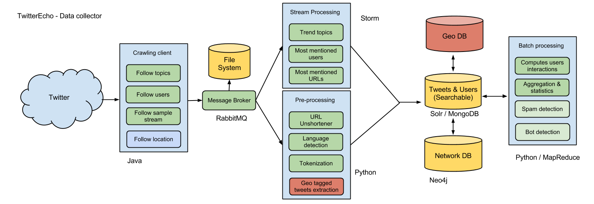

Architecture
##############

This section describes each layer of SocialBus. 

Tweets are received from the Twitter streaming API using crawler client and sent to a messaging exchange. The tweets are read from the messaging queue and processed by the computing unit. See diagram below.

Crawling
--------

Messaging layer
---------------
We are using RabbitMQ for our messaging system plus the Python helper library py-amqlib. An exchange is created to receive the posts and a consumer reads the messages from a queue. Those messages are processed by the computing unit. The advantage of using a messaging queue is we can handle surge of tweets. 

Stream processing layer
-----------------------
Storm runs topologies to compute in realtime trend topics, most mentioned users, urls and etc. The result is stored at MongoDB.

Data Persistence
-----------------
Data Persistence is made in various ways. Tweets are collected and saved on disk, after pre-processing they are indexed in MongoDB and Apache Solr for free text searching.

High availability
-----------------
Each element above can be highly-available with the use of an extra server. We can add one more server receiving the tweets in case the active one fails over. We can detect this type of failure using an heartbeat between the active and the stand-by instance. RabbitMQ supports mirror queues. MongoDB and Solr supports replicas and master/slave architecture.
