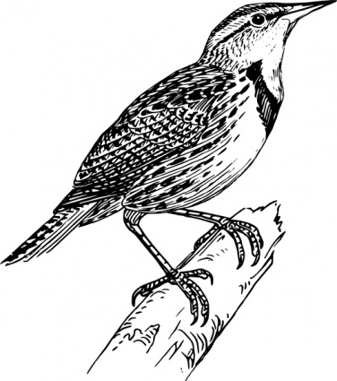

Welcome to SocialBus
########################

   
Welcome to SocialBus's documentation.

The project is being developed at the `Faculty of Engineering of the University of Porto <http://www.fe.up.pt/>`_ and is partially funded by the `REACTION <http://dmir.inesc-id.pt/reaction/Reaction>`_ grant (funded by FCT, Ref. UTA-Est/MAI/0006/2009) and `Sapo Labs <http://labs.sapo.pt>`_ .  

SocialBus aims to be a fault tolerant data collector for social networks. Currently it supports Twitter and Facebook.

The :ref:`rationale` page explains what SocialBus is and why it was built.

.. toctree::
   :maxdepth: 1

   rationale

How it works
------------
SocialBus comes with Facebook and Twitter consumers. You can extend and implement yours.

* SocialBus Twitter Consumer is used to monitor and consume tweets from Twitter. Users can define which keywords or users they are interested in. Users can deploy as many consumers as wanted.
* SocialBus Facebook Consumer is capable of searching posts on Facebook based also on keywords. 

When a consumer receives a tweet it sends the message to SocialBus Server which is responsable for processing, extracting metadata, indexing, tokenizing and other computations. 

This documentation has all the instructions to deploy you own SocialBus instance.

Architecture
------------

.. image:: _static/twitterecho/socialecho_architecture.png
   :width: 550px

Download 
---------------------

If you intend to use TwitterEcho, please cite the following paper:
“Matko Bošnjak, Eduardo Oliveira, José Martins, Eduarda Mendes Rodrigues, Luís Sarmento “TwitterEcho – A Distributed Focused Crawler to Support Open Research with Twitter Data”, World Wide Web Conference 2012, April 16–20, 2012, Lyon, France”

Release v0.6 - Compatible with any UNIX system

- `SocialBus 0.6 <http://goo.gl/HwX0f5>`_

.. include:: contents_modes.rst.inc

.. include:: SUPPORT
.. include:: PROJECTS
.. include:: CONTRIBUTIONS
